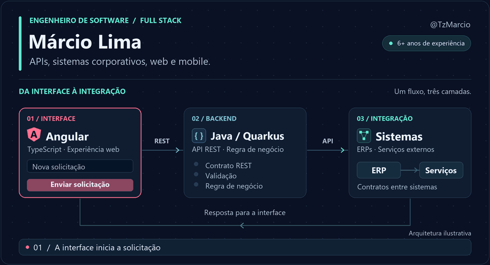

  

  <a href="https://www.linkedin.com/in/marcio-lima-araujo/">LinkedIn</a>
  &nbsp; · &nbsp;
  <a href="https://github.com/TzMarcio?tab=repositories">Código público</a>
  &nbsp; · &nbsp;
  <a href="./assets/architecture-flow-static.png">Ver imagem sem animação</a>

## Engenharia de software para sistemas que precisam evoluir

Sou **Márcio Lima Araujo**, engenheiro de software com **mais de seis anos de experiência**. Trabalho principalmente com **Java, Spring Boot e Quarkus**, desenvolvendo APIs, microsserviços e integrações. Minha experiência full stack também inclui **Angular, TypeScript, Node.js e aplicações mobile com Ionic**.

Grande parte da minha atuação está em **sistemas corporativos e repositórios privados**. Aqui compartilho minha trajetória, minhas competências e algumas experiências pessoais.

### Onde concentro minha atuação

- **Conectar sistemas:** contratos de API, regras de negócio e integrações com ERPs e serviços externos.
- **Evoluir aplicações:** manutenção, modernização de legados e organização de código por domínio e responsabilidade.
- **Entregar com qualidade:** testes automatizados, revisão de código, CI/CD e investigação de problemas em produção.

### Tecnologias que fazem parte do meu trabalho

| Frente | Tecnologias e práticas |
| :--- | :--- |
| Backend | Java 17+ · Spring Boot · Quarkus · Node.js |
| Frontend e mobile | Angular · TypeScript · JavaScript · Ionic · Capacitor |
| Arquitetura | APIs REST · Microsserviços · Sistemas distribuídos · Mensageria |
| Persistência | SQL · PostgreSQL · MongoDB |
| Qualidade | JUnit · Mockito · Clean Code · SOLID · Observabilidade |
| Entrega | Git · Docker · Azure · Azure DevOps · CI/CD |

### Além do trabalho

Nos projetos pessoais, exploro **React e Next.js**, autenticação e sessões, além de **Drizzle ORM e SQLite em aplicações Capacitor**. Também uso **agentes de IA no desenvolvimento**, com atenção à especificação, aos testes e à revisão dos resultados.

<strong>Minha trajetória profissional e formação</strong>

 

**DB Server · Engenheiro de Software**  
Junho de 2025 — atual

Desenvolvimento e evolução de microsserviços com Java, Spring Boot e Quarkus; APIs REST e integrações entre sistemas. Trabalho com produto, QA e design, aplicando testes automatizados, CI/CD e boas práticas de engenharia.

**ITSS Tecnologia · Engenheiro de Software**  
Janeiro de 2020 — junho de 2025

Desenvolvimento full stack com Angular, TypeScript, Java/Spring Boot e Node.js. Integrações com ERPs e serviços externos, manutenção e evolução de aplicações, análise de logs e investigação de incidentes em produção.

Comecei na **ITSS em setembro de 2019**, como estagiário de desenvolvimento, trabalhando com aplicações desktop, web e mobile.

**Análise e Desenvolvimento de Sistemas · UNIP**  
Concluído em 2020.

---

Vamos conversar sobre **Java, arquitetura, integrações e desenvolvimento full stack**? Me encontre no [LinkedIn](https://www.linkedin.com/in/marcio-lima-araujo/).
