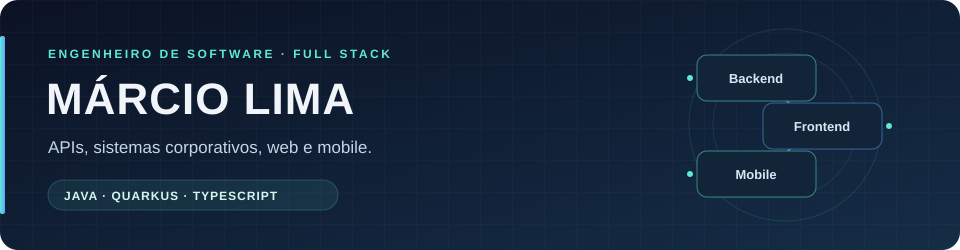

  

  <a href="https://www.linkedin.com/in/marcio-lima-araujo/">LinkedIn</a>
  &nbsp; · &nbsp;
  <a href="https://github.com/TzMarcio?tab=repositories">Código público</a>

## Engenharia de software para sistemas que precisam evoluir

Sou **Márcio Lima Araujo**, **engenheiro de software com mais de seis anos de experiência** em aplicações web, mobile e backend. Minha atuação principal está em **Java, Spring Boot e Quarkus**, APIs REST, microsserviços e integração entre sistemas.

Tenho experiência full stack com **Angular, TypeScript e Node.js**, além de desenvolvimento mobile com **Ionic**. Trabalho no desenvolvimento e na manutenção de sistemas corporativos, combinando regras de negócio, qualidade de código e atenção ao comportamento das aplicações em produção.

**A maior parte do meu trabalho está em projetos de empresas e repositórios privados.** Este perfil reúne minha trajetória, as competências que aplico nesses contextos e as frentes que venho desenvolvendo.

## Experiência profissional

### DB Server · Engenheiro de Software
**Junho de 2025 — atual**

- Desenvolvimento e evolução de microsserviços com Java, Spring Boot e Quarkus, com foco em escalabilidade, resiliência e performance.
- Implementação de APIs REST e integrações entre sistemas distribuídos.
- Análise de requisitos e definição de soluções com produto, QA e design, aplicando testes automatizados, CI/CD e Clean Code.

### ITSS Tecnologia · Engenheiro de Software
**Janeiro de 2020 — junho de 2025**

- Desenvolvimento e manutenção de aplicações full stack com Angular e TypeScript, Java/Spring Boot e Node.js.
- Integrações com ERPs e serviços externos, revisão de código e evolução das aplicações.
- Investigação de incidentes em produção, análise de falhas e logs, correções e otimizações de performance.

Minha trajetória começou na **ITSS, em setembro de 2019**, como estagiário de desenvolvimento, trabalhando com aplicações desktop, web e mobile.

## O que trago para os projetos

- **Backend e integração:** APIs, microsserviços, mensageria e contratos que conectam aplicações e regras de negócio.
- **Evolução de arquitetura:** organização por domínio, separação de responsabilidades, DTOs, mappers e validações com Jakarta Validation.
- **Modernização de sistemas legados:** análise de regras e dependências, identificação de riscos e planejamento de migrações incrementais.
- **Qualidade e operação:** testes automatizados, revisão de código, observabilidade, troubleshooting e análise de logs.
- **Entrega de software:** Docker, CI/CD e pipelines no Azure DevOps, com organização das entregas por ambiente.
- **Desenvolvimento apoiado por IA:** agentes como apoio à especificação, implementação, testes e revisão, com validação dos resultados.

## Tecnologias e práticas

| Área | Stack |
| :--- | :--- |
| Backend | Java 17+ · Spring Boot · Quarkus · Node.js |
| Frontend | Angular · TypeScript · JavaScript |
| Mobile | Ionic · Capacitor |
| Arquitetura | APIs REST · Microsserviços · Sistemas distribuídos · Arquitetura orientada a eventos · Mensageria |
| Persistência | SQL · PostgreSQL · MongoDB |
| Qualidade | Testes automatizados · JUnit · Mockito · Clean Code · SOLID |
| Entrega | Git · Docker · Azure · Azure DevOps · CI/CD |
| Colaboração | Análise de requisitos · Revisão de código · Scrum · Kanban |

## Projetos pessoais

Nos projetos pessoais, também trabalho com **React e Next.js**, integração entre frontend e backend, autenticação e sessões, além de **Drizzle ORM e SQLite em aplicações Capacitor**. Essas iniciativas complementam minha experiência profissional e dão espaço para explorar novas ferramentas e formas de desenvolver software.

## Formação

**Análise e Desenvolvimento de Sistemas** — UNIP, concluído em 2020.

---

Para conversar sobre **Java, arquitetura, integração de sistemas e desenvolvimento full stack**, encontre-me no [LinkedIn](https://www.linkedin.com/in/marcio-lima-araujo/).
